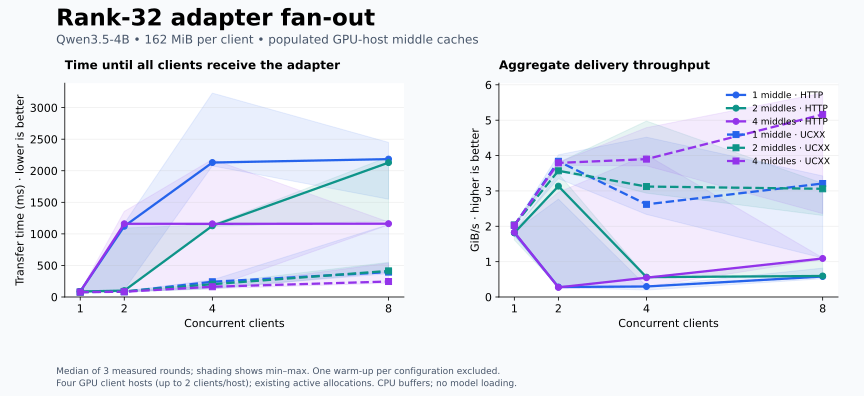
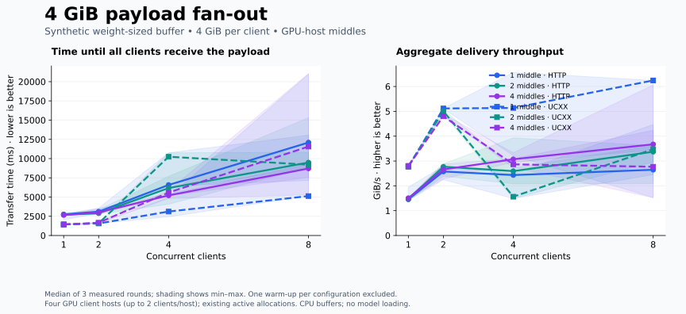

# Adapter transfer benchmarks

## Rank-32 adapter fan-out

A real **Qwen3.5-4B rank-32 LoRA adapter**, **169,903,238 bytes (162.03 MiB)**,
was delivered through **1, 2, and 4 middle caches hosted in policy GPU allocations** to **1, 2, 4, and 8
concurrent clients** on September 17, 2026.

[Download PNG](assets/benchmarks/adapter-fanout.png) ·
[Raw measurements and topology](assets/benchmarks/fanout-results.json) ·
[Summary statistics](assets/benchmarks/fanout-summary.json)

### What the plot measures

- Each middle holds the complete adapter in RAM before timing begins. Cache
  population uses HTTP; **origin-to-middle loading is excluded**.
- Clients are assigned round-robin to the selected middle caches, with a rotated
  assignment to avoid same-host transfers in this measured run. Co-location is
  allowed: the runner now defaults to allowing same-host transfers; set
  `BENCH_AVOID_SAME_HOST=1` to reproduce the cross-host assignment. Each client
  downloads the complete adapter from one middle; this is replicated-cache
  fan-out, not a benchmark of sharding one adapter across multiple middles.
- Clients run on four GPU hosts, up to two client threads per host. Transfer
  buffers are in CPU memory; no GPU model installation or inference is timed.
- A round starts at the earliest client download call and ends when the last
  download returns. Aggregate throughput is total bytes delivered to all clients
  divided by that interval. Cross-host timestamps use the nodes' wall clocks;
  clock offsets were not independently calibrated. Recorded start skew is included
  in the raw data.
- Lines show the median of **three measured rounds**; bands show their minimum
  and maximum. One warm-up round per configuration is excluded. Every returned
  payload is SHA-256 verified after its transfer timer stops.
- HTTP and UCXX alternate order. Strict UCXX never falls back to HTTP. Middle
  nodes and client nodes share allocations with an active deployment, so these
  are practical measurements under shared load, not isolated network limits.

### Outcome

All **96 rounds completed without a failed transfer**: 12 configurations, two
transports, and four rounds including warm-up. This establishes successful
GPU-host fan-out for this run, not a universal requirement for GPU hardware.
HTTP latency had substantial variation; the plotted ranges retain it.

### Comparison with CPU-middle placement

The earlier CPU-middle benchmark is preserved separately:
[CPU-middle plot](assets/benchmarks/cpu-middles/adapter-fanout.svg) ·
[CPU-middle measurements](assets/benchmarks/cpu-middles/fanout-results.json).
It completed UCXX tests at one and two clients but hit an endpoint connection
failure at four clients. The GPU-middle rerun tests placement as a possible
factor; it does not establish that UCXX requires a GPU host.

Both experiments use CPU memory buffers. GPU-host placement changes the host,
network/runtime environment, and shared load, not the payload memory type.

### Hardware and runtime

| Role | Hosts |
|---|---|
| Origin | g3094 |
| GPU-host middles | g3094, g3119, g3097, g3099 |
| Clients | g3118, g3119, g3097, g3099 |

Both transports use the nodes' `ib0` addresses. UCXX uses system UCX 1.18.0,
UCXX 0.48.0, `TLS=rc`, `NET_DEVICES=mlx5_0:1`, and `SOCKADDR_TLS_PRIORITY=rdmacm`.
The benchmark used the existing Python 3.10 environment with UCXX installed;
this is not a validation of the package's supported Python installation range.
Payload shards are 16 MiB. Middle RAM capacity is 512 MiB per process.

The scripts are in `benchmarks/fanout/`: `run.py` coordinates isolated Slurm
steps inside existing Rex allocations; `node.py` runs origins, real LiteCast
middles, and clients; `plot.py` renders the figures. Allocation IDs and runtime
paths in the scripts are specific to this experiment and must be updated before
re-running. Production services are not changed or restarted.

## Earlier point-to-point baseline

The same payload was transferred from g3094 to g3119, directly from an origin,
with five warm measurements per transport:

| Transport | Median transfer time | Median throughput | First transfer |
|---|---:|---:|---:|
| HTTP | 97.52 ms | 1.62 GiB/s | 1.20 s |
| UCXX | 82.37 ms | 1.92 GiB/s | 9.47 s |

UCXX provided **18.4% higher warm throughput** in this two-node test. Its first
transfer logged a connection retry. This baseline has no CPU middle and should
not be mixed with the fan-out measurements.

## Larger payload: 4 GiB

This follow-up uses **4,294,967,296 random bytes**, approximately **25.3×** the
rank-32 adapter payload. It represents model-sized data movement, **not an actual
model checkpoint**. It uses the same GPU-host middle placements, cross-host
client assignments, 16 MiB shards, three measured rounds plus warm-up, and
checksum verification. Each benchmark process permits a payload of 4 GiB plus
64 MiB of cache headroom. Co-located middle and client processes still share
host memory bandwidth and the NIC even when each transfer crosses hosts.

The original adapter measurements above remain available for comparison.

[Download PNG](assets/benchmarks/4gib/adapter-fanout.png) · [Raw data](assets/benchmarks/4gib/fanout-results.json) · [Summary](assets/benchmarks/4gib/fanout-summary.json)

All **96 rounds completed without failed transfers**. At eight clients, each round delivers **32 GiB**. Warm median delivery times:

| Middles | HTTP | UCXX |
|---|---:|---:|
| 1 | 12.09 s | 5.12 s |
| 2 | 9.49 s | 9.21 s |
| 4 | 8.71 s | 11.56 s |

The largest UCXX configuration varied from **5.28 to 21.06 seconds**, with a median of **11.56 seconds**, versus **8.71 seconds** for HTTP. UCXX was not consistently faster at this payload size and topology. Three repeats on shared active allocations do not establish a scaling law or a stable capacity limit.

The initial one-middle/eight-client UCXX round took **37.88 seconds**, excluded from warm medians but retained in the raw data. The slow warm round is included in both statistics and shaded ranges.
